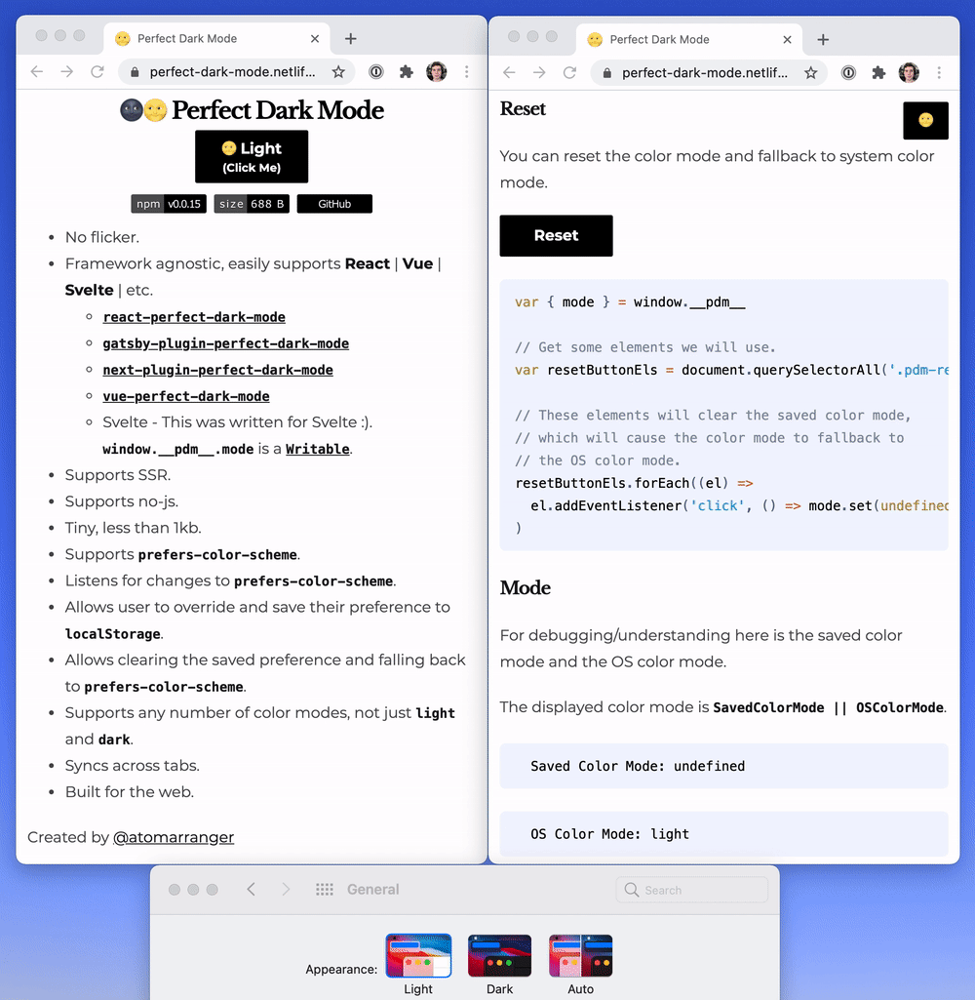

# 🌚🌝 Perfect Dark Mode

[![Version][version-badge]][package]
[![Size][size-badge]][size]

[package]: https://www.npmjs.com/package/perfect-dark-mode
[version-badge]: https://img.shields.io/npm/v/perfect-dark-mode.svg
[size]: https://bundlephobia.com/result?p=perfect-dark-mode
[size-badge]: https://img.shields.io/bundlephobia/minzip/perfect-dark-mode?label=size



- No flicker.
- Framework agnostic, easily supports **React** | **Vue** | **Svelte** | etc.
  - [`react-perfect-dark-mode`][react-perfect-dark-mode]
  - [`gatsby-plugin-perfect-dark-mode`][gatsby-plugin-perfect-dark-mode]
  - [`next-plugin-perfect-dark-mode`][next-plugin-perfect-dark-mode]
  - [`vue-perfect-dark-mode`][vue-perfect-dark-mode]
  - Svelte - This was written for Svelte :). `window.__pdm__.mode` is a [`Writable`](https://svelte.dev/docs#writable).
- Supports SSR.
- Supports no-js.
- Tiny, less than 1kb.
- Supports `prefers-color-scheme`.
- Listens for changes to `prefers-color-scheme`.
- Allows user to override and save their preference to `localStorage`.
- Allows clearing the saved preference and falling back to `prefers-color-scheme`.
- Supports any number of color modes, not just `light` and `dark`.
- Syncs across tabs.
- Built for the web.

[react-perfect-dark-mode]: https://github.com/DylanVann/perfect-dark-mode/tree/main/packages/react-perfect-dark-mode
[gatsby-plugin-perfect-dark-mode]: https://github.com/DylanVann/perfect-dark-mode/tree/main/packages/gatsby-plugin-perfect-dark-mode
[next-plugin-perfect-dark-mode]: https://github.com/DylanVann/perfect-dark-mode/tree/main/packages/next-plugin-perfect-dark-mode
[vue-perfect-dark-mode]: https://github.com/DylanVann/perfect-dark-mode/tree/main/packages/vue-perfect-dark-mode

## Installation

### Yarn

```bash
yarn add perfect-dark-mode
```

Then you must add `node_modules/perfect-dark-mode/dist/index.js` as a script in the `<head>` of your page.

How you do this will depend on the framework you are using.

### UNPKG

Add this code to the `<head>` of your page:

```html
<script src="https://unpkg.com/perfect-dark-mode@0.0.16/dist/index.js"></script>
```

### Copy and Paste

Add this code to the `<head>` of your page:

```js
<script>(()=>{const M=({prefix:l="pdm",modes:C=["light","dark"]}={})=>{const i=l,u=window.localStorage;let s=C;const h=(()=>{const r=new Set,d=e=>{s=e,r.forEach(a=>a(e))};return{subscribe(e){return e(s),r.add(e),()=>r.delete(e)},set:d,update(e){d(e(s))}}})(),f=(()=>{const r=new Set,d=matchMedia("(prefers-color-scheme: dark)");let e;const a=({matches:t})=>{const n=t?"dark":"light";e=n,r.forEach(o=>o(n))};return d.addEventListener?d.addEventListener("change",a):d.addListener(a),a(d),{subscribe(t){return t(e),r.add(t),()=>r.delete(t)}}})(),c=(()=>{const r=o=>o?s.includes(o)?o:s[0]:void 0,d=new Set;let e;const a=o=>{if(o===e)return;o!==void 0?u.setItem(i,o):u.removeItem(i),d.forEach(g=>g(o)),e=o},t=u.getItem(i),n=r(t);return e=n,window.addEventListener("storage",o=>o.key===i&&a(o.newValue||void 0)),{subscribe(o){return o(n),d.add(o),()=>d.delete(o)},set:a,update(o){a(o(e))}}})(),m=(()=>{let r,d,e;const a=new Set;return c.subscribe(t=>{r=t;const n=r||d;n!==e&&(e=n,a.forEach(o=>o(e)))}),f.subscribe(t=>{d=t;const n=r||d;n!==e&&(e=n,a.forEach(o=>o(e)))}),{subscribe(t){return a.add(t),t(e),()=>a.delete(t)},set:c.set,update(t){const n=s.indexOf(e)||0;c.set(t(e,s,n))}}})(),b=document.documentElement.classList;let p;return m.subscribe(r=>{p&&b.remove(`${l}-${p}`),r&&b.add(`${l}-${r}`),p=r}),b.add(l),{mode:m,modes:h,modeOS:f,modeSaved:c}};window.__pdm__=M({modes:document.documentElement.dataset.pdm?.split(" ")});})();</script>
```

## Usage

A class indicating the color mode will be added to `<html>` (e.g. `pdm-light` or `pdm-dark`).
This is done before the rest of your page is rendered (that's why it needs to be in head).

### This package does:

- Determine the correct color mode when the page is loaded.
- Save changes to the mode.
- Allow for listening to the mode and building controls that depend on it.

### This package does not:

- Handle styling for you.
  - Styling should be done using CSS variables.
- Automatically convert your page to dark mode.
  - This would be error prone, it is better to intentionally design your color modes using CSS variables.
- Provide UI components for you.
  - This page does show some examples of how to make simple controls in various frameworks that listen to the mode.

Here is a simple implementation of dark and light modes using CSS variables and the classes added by PDM:

```css
/* This supports users with JS disabled. */
@media (prefers-color-scheme: dark) {
  :root {
    --color: white;
    --background: black;
  }
}

/* This supports users with JS disabled. */
@media (prefers-color-scheme: light) {
  :root {
    --color: black;
    --background: white;
  }
}

/* Styles for when light mode is enabled. */
.pdm-light {
  --color: black;
  --background: white;
}

/* Styles for when dark mode is enabled. */
.pdm-dark {
  --color: white;
  --background: black;
}

/* Default color and background. */
/* If you add a color or background on other components (e.g. body or some custom Button) */
/* that will override these. You will need to change those styles to use these CSS variables. */
:root {
  color: var(--color);
  background: var(--background);
}
```

In the rest of your app use `--color` and `--background` as needed.

### Listening

- You can `subscribe` to the mode, this can be used for rendering a toggle component.
- The first call of your listener is synchronous so you can get the value before rendering.

```js
const { mode } = window.__pdm__
const unsubscribe = mode.subscribe((v) => console.log(v))
```

### Setting

- You can `set` the mode.
- You can `update` the mode based on the current mode.

```js
const { mode } = window.__pdm__
mode.set('light')
mode.update((mode) => (mode === 'light' ? 'dark' : 'light'))
```

## API Reference

- `window.__pdm__`
  - `mode: Writable<ColorMode>`
    - The resolved mode, `modeSaved || modeOS`.
    - Can be set or updated.
    - `subscribe(listener: (mode: ColorMode) => void): () => void`
    - `set(mode: ColorMode): void`
    - `update(updater: (mode: ColorMode, modes: ColorMode[], index: number | undefined) => ColorMode): void`
      - The update function gives you the current modes and the current mode index so you can cycle
        through by returning `modes[(modeIndex + 1) % modes.length]`.
  - `modes: Writable<ColorMode[]>`
    - Valid color modes, can be used to render a list.
    - Can be set or updated.
    - `subscribe(listener: (modes: ColorMode[]) => void): () => void`
    - `set(modes: ColorMode[]): void`
    - `update(updater: (modes: ColorMode[]) => ColorMode[]): void`
  - `modeSaved: Writable<ColorMode>`
    - This is mainly for debugging, prefer using `mode`.
    - `subscribe(listener: (mode: ColorMode) => void): () => void`
  - `modeOS: Readable<ColorMode>`
    - This is mainly for debugging, prefer using `mode`.
    - The OS mode cannot be written by JS, it can
      be updated by the user in their system settings.
    - We do listen for changes to the OS color mode.
    - `subscribe(listener: (mode: ColorMode) => void): () => void`

## Pure Usage

If for some reason you don't want PDM to automatically initialize itself and add itself on `window.__pdm__` you can use the pure version:

```js
import { createPerfectDarkMode } from 'perfect-dark-mode'

const pdm = createPerfectDarkMode()
```

This version comes in a couple module formats:

- `dist/pure.js` - CJS
- `dist/pure.mjs` - ESM

